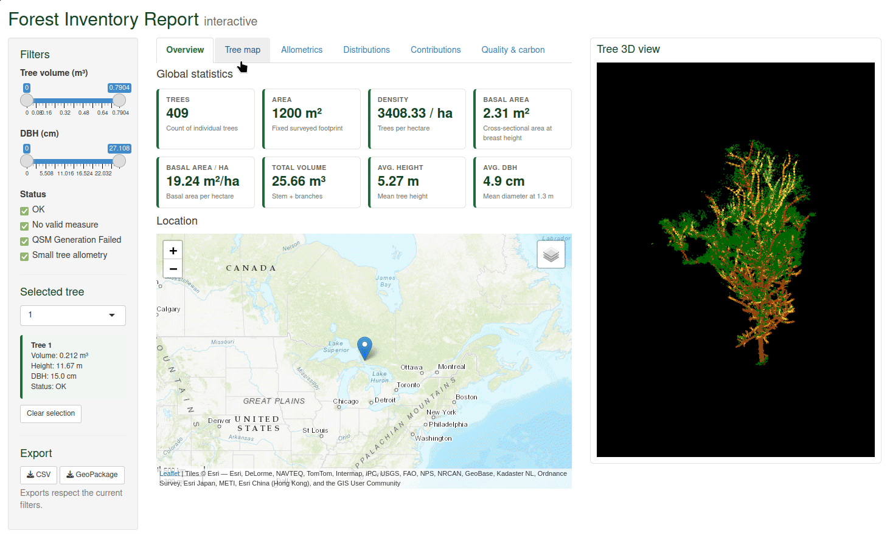

# arborShinyReport

Interactive forest inventory report (Shiny) for `arbor`.

## Install

```r
remotes::install_github("r-lidar-lab/arborShinyReport")
```

## Use

First, run the `arbor` pipeline following the online [arbor book](https://r-lidar.github.io/arbor_book/). At the end of the pipeline, you should have a segmented point cloud (`las`) and a Quantitative Forest Model (`qsf`).

Once you have these two objects:

```r
library(arborShinyReport)
shiny_report(qsf, las)
```



## Note on AI

For full transparency, this package was mostly (approximately 95%) generated by an AI, based on real code examples and feature descriptions provided as prompts.

The package consists largely of repetitive Shiny application code and documented interface logic. AI tools were used to generate much of this implementation, while the underlying requirements, examples, and functionality were prompted by the author.
